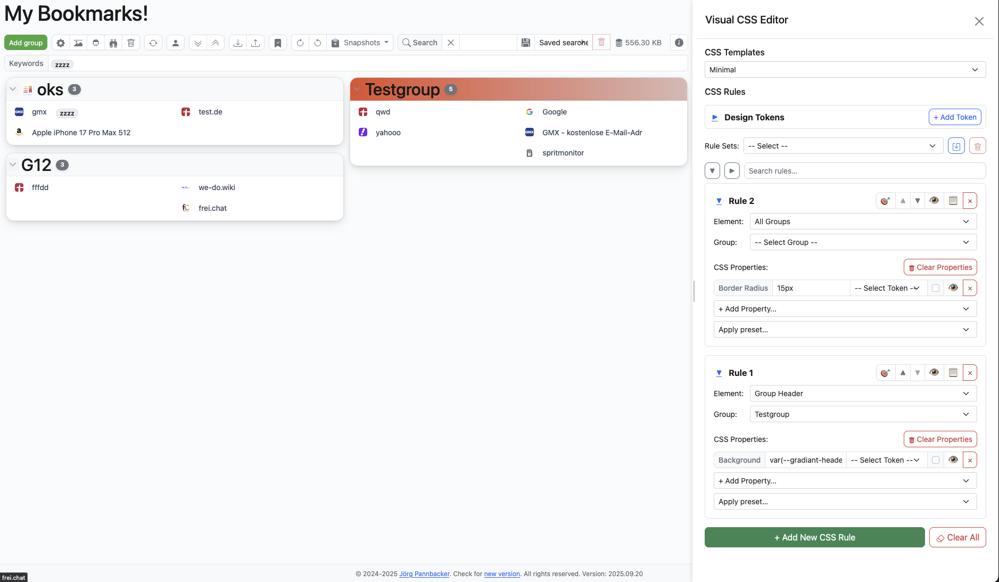

# MyBookmarks

A standalone bookmark manager built with HTML, CSS, and JavaScript. Vue.js powers the reactive UI layer, while Bootstrap provides layout components and utility styling. The main app runs entirely inside the browser, keeps its data local, and uses browser storage plus IndexedDB-backed helper flows for encryption, API vault, and migration features. No build tooling is required—open the file in any modern browser to explore the full experience.

## Screenshot

## Features

- **Rich bookmark workspace** – Organise links into draggable groups, expand/collapse sections, edit inline, tag with keywords, and surface link metadata with detailed popovers.
- **Structured entries beyond URLs** – Add visual separators and rich note entries inside groups, collapse/expand note content inline, and keep sorting workflows separator-aware.
- **Reference links** – Create symbolic links that point to one canonical link record, place them in multiple groups, and keep URL/metadata centrally maintained while allowing per-reference alias text, local keywords, and source-keyword inheritance control.
- **URL templates, placeholder rules & Prompt Flow** – Use placeholder variables globally, per group, and per link/reference, layer inherited rules on top, and build guided runtime flows with conditional steps, branches, workflow variables, API load points, assign steps, and resolved preview hints.
- **Guided link setup & Quick Add** – Start from a simplified link editor with simple/advanced modes, presets, Quick Add, per-field API badges, and deep links into the full technical configuration.
- **API integrations & API Vault** – Configure shared connections, endpoints, response mappings, placeholder sources, and link actions in one manager, with inline testing, path picking, runtime prompt integration, OAuth2 PKCE/Device Code/Client Credentials, and encrypted local secret storage.
- **Advanced search & discovery** – Filter across groups and links, highlight duplicates, inspect JSON payloads, and capture snapshots for undo/redo workflows.
- **Flexible import/export** – Round-trip data through JSON, CSV, Netscape HTML, and clipboard pastes. Dedicated dialogs support import previews (selectable groups/links), and full exports include settings, identity, contacts, snapshots, and Visual CSS Editor state.
- **Favicon management** – Auto-fetch icons, upload/remove per item, maintain reusable favicon rules with presets/comments/testing/JSON export-import/default restoration, and optionally enable an external fallback provider for missing icons.
- **Collaboration & sharing (optional)** – Push updates via ntfy topics, invite collaborators, manage contacts with Quick-Connect pairing, generate QR codes, broadcast snapshots, and reconcile conflicts through the integrated event-log system.
  - **Encrypted ntfy delivery** – Each client derives its own public/private key pair; messages are encrypted end-to-end when sharing entire groups, individual links, or broadcast snapshots.
- **Member & permission management** – Shared groups support owner/member roles, per-member Add/Edit/Delete permissions, member removal, and ownership transfer.
- **Sync integrations (optional)** – Hook into Nextcloud Bookmarks REST endpoints or CardDAV servers, complete with hash caching, rate limits, conflict handling, and diagnostics.
- **Deep customization** – Toggle dark mode, apply per-element styling through the visual CSS editor (including dedicated selectors for links, separators, and notes), and expose advanced developer routing with extensive logging utilities.
- **Shortcut manager & productivity** – Define global tree-based shortcuts, group-level shortcuts, and get overlap/conflict hints directly in edit dialogs.
- **Link safety insights** – Analyse URLs in real time, flag suspicious patterns (dangerous protocols, token leakage, punycode, shorteners) and surface actionable hints directly in the UI.
- **Flexible networking** – Route outbound requests via the browser companion extension **or** a self-hosted proxy, configurable per workspace, complete with custom headers and API token support.
- **Local encryption & session locking** – Encrypt IndexedDB data with a password, unlock through a dedicated lock-screen dialog, lock instantly from the toolbar, and auto-lock after configurable inactivity.

## Technology Stack

- **Vue.js** – Core view-model binding and reactivity for the application shell and dialogs.
- **Bootstrap 5 (JS/CSS)** – Modal/dialog behaviour, layout helpers, and component styling.
- **jQuery (trimmed build)** – Legacy DOM utilities leveraged by helper routines.
- **Dexie.js** – IndexedDB wrapper used for local persistence and migration flows.
- **JMESPath & JSONata** – Expression and transformation engines used by API response mapping, Prompt Flow assignments, and advanced conditions.
- **Plain HTML/CSS/ES2015+ JavaScript** – Custom business logic, state management, and UI rendering.

## Getting Started

1. Download the latest [release](https://github.com/akdk7/mybookmarks/releases)
2. Open the MyBookmarks.html file in your browser from your local directory
3. Enjoy the MyBookmarks app, it runs without a webserver :)
4. Review the local [wiki overview](local2/wiki/home.md) and the versioned [release notes](release_notes/) for setup details on API integrations and Prompt Flow

## Data Management

- Core workspace data is kept locally in browser storage. The classic bookmark payload lives under the `links` `localStorage` key, while encrypted and security-sensitive helper data is handled through IndexedDB-backed flows.
- Use the built-in backup/restore dialogs and backup activity log for safer migrations; placeholder, rule, Prompt Flow, and API-binding changes are easier to audit there before an update.
- The favicon rules dialog supports JSON import/export, letting you version-control shared rule sets.
- Snapshots and duplicate reports are available from the toolbar for quick diagnostics.
- The toolbar includes a storage usage indicator; regular full exports are recommended for backup and migration.

## Security Options

- Enable local encryption under **Options → Security**. Once a password is set, all data saved to IndexedDB is encrypted; unlocking requires the same password and cannot be recovered if lost.
- Use the lock icon next to “Add group” to manually re-lock an open session without refreshing. Enter the password again to continue working.
- Toggle *Lock session automatically* to have MyBookmarks lock itself after a configurable period (5–60 minutes) of inactivity. Any keyboard, mouse, or touch interaction resets the timer.
- The API Vault can store API keys, client secrets, and OAuth tokens locally behind its own password, so protected integrations stay out of plain-text workspace data.

## API Integrations & Prompt Flow

- Use the `API Integrations` manager to define connections, endpoints, response mappings, placeholder sources, action templates, cache settings, and test runs in one place.
- Keep the technical request setup centralized, then consume it from links and runtime prompts through guided link configuration, API-backed placeholders, and execution modes.
- Build multi-step Prompt Flow sequences that ask for input, branch conditionally, load API-backed values at explicit points, assign derived values to placeholders or workflow vars, and then execute the link.

## Sync & Sharing

- **Nextcloud Bookmarks** – Configure server URL, credentials, and folder scope; the app handles folder discovery, hashing, and conflict resolution.
- **CardDAV** – Optional address-book sync (requires the browser extension) with scheduling, token management, and logging.
- **ntfy / Invitations** – Share selections or entire groups via ntfy topics or contact invites, with QR-code and clipboard helpers built in.
- **Contacts / Quick-Connect** – Pair contacts via code flow and manage sharing participants centrally.

## Customisation

- Use the visual CSS editor to tweak colours, typography, and layout on a per-element or per-group basis.
- Define global or scoped design tokens; export presets for reuse across workspaces.
- Toggle dark mode, adjust performance thresholds, and reshuffle layout defaults from the options dialog.

## Keyboard & Productivity Tips

- Double-click group titles to edit in place; drag via the handle to reorder groups.
- Use the snapshots dropdown for quick undo/redo checkpoints.
- Use the Shortcut Manager for global and group-level keyboard launchers.
- Hover link badges for metadata popovers; detailed inspectors are available from the toolbar.

## Contributing

This prototype is intentionally self-contained. If you spot issues or want to propose enhancements, open a discussion or pull request describing the change and manual test steps.

## AI-Generated Code Caveats

Large portions of this project were produced with the help of AI tooling. While functional, the codebase may exhibit behaviours that experienced developers could perceive as unpolished:

- Redundant or duplicated logic blocks that were never consolidated.
- Mixed naming conventions and inconsistent formatting/comment styles.
- Defensive checks that overlap with upstream validations or are overly verbose.
- Legacy compatibility shims left in place even when feature flags have moved on.
- Sprawling utility helpers (e.g., logging, DOM tweaks) that could be simplified or modularised.

Treat the implementation as a prototype; refactoring and alignment with your team’s standards are encouraged before production use.

---

> **Note**
> Testing is manual: after changes, add/edit/remove links, verify persistence, exercise import/export workflows, and trigger the favicon-rule presets to confirm UI additions.
